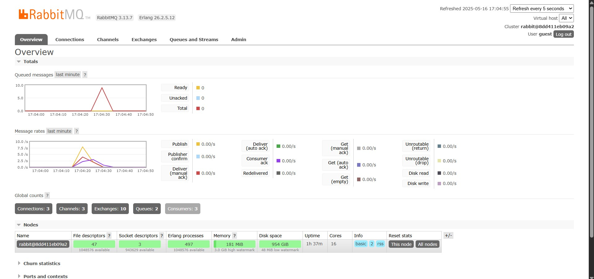

# Advanced Programming Module 9

## Module 09 - Software Architecture

### Reflection

1. What is amqp?
```
AMQP or Advaned Message Qeueing Protocol is standard protocol for message oriented middleware in the application layer. It allows applications to communicate through message brokers that supports the protocol and allows handling of messages throughout different systems.

```

2. What does it mean? guest:guest@localhost:5672 , what is the first guest, and what is the second guest, and what is localhost:5672 is for?
```
That is an AMQP URI for connecting to a RabbitMQ server. 

In "guest:guest@localhost:5672", the first and second guest are used
for authenticating
with the RabbitMQ server. The first guest is the username for the message
broker whle while the second guest is the password.

The string "localhost:5672" is the RabbitMQ server's address and it is used
here so the program can connect to it. "localhost" is th e hostname and "5672"
is the port number on the RabbitMQ server.
```

##### Simulating Slow Subscriber

I ran the publisher 5 times in quick succession and got a queue of 15. The queue
is there because the messages are processed more slower so unprocessed messages
have to wait in a queue.

##### Simulating Many Subscribers

I ran the publisher 6 times in quick succession and got a queue of 10, which
is less than before because the messages are distributed between the three
subscribers. Hence, there are less messages in the queue.